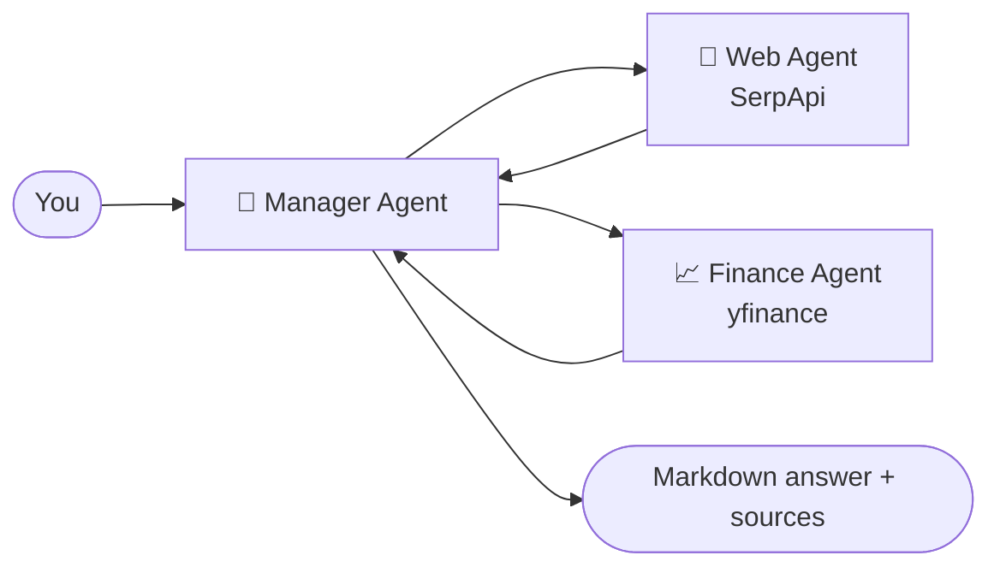

<div align="center">

# 💸 Arash+ Finance Assistant

**A multi-agent financial assistant that searches the web, pulls live market data and answers in clean markdown tables.**


</div>

---

## ✨ Features

- 🤖 **Agent team** built with [Agno](https://github.com/agno-agi/agno): a Manager coordinates a Web Agent and a Finance Agent.
- 🔎 **Web Agent** - searches crypto, forex and finance news with SerpApi and always cites sources.
- 📈 **Finance Agent** - real-time stock prices, analyst recommendations, fundamentals and company info via `yfinance`.
- 🧬 **Choose your model** - pick from several Groq-hosted models (Llama 3.3 70B, Llama 4 Maverick, DeepSeek R1 distill, Qwen 3 and more) in the sidebar.
- 💬 **Chat interface** with session history, markdown answers and tables.
- 🌍 Answers in the language you write in (Persian works with the Llama models).
- ☁️ **Auto-sync to Hugging Face Spaces** with a GitHub Action on every push to `main`.

## 🧩 How it works



## 🚀 Getting Started

### Prerequisites

- Python 3.10+
- A [Groq API key](https://console.groq.com/keys)
- A [SerpApi key](https://serpapi.com/dashboard) (for web/news search)

### Install & run

```bash
git clone https://github.com/Arashomranpour/FinanceAgent1.git
cd FinanceAgent1
pip install -r requirements.txt
streamlit run app.py
```

Enter your Groq and SerpApi keys in the sidebar (they are typed into password fields and are not stored), choose a model, and start asking questions such as *"Latest news and current price for NVDA"*.

## 📁 Project Structure

```
.
├── app.py                         # Streamlit UI + Agno agent team
├── requirements.txt
└── .github/workflows/main.yml     # Sync to Hugging Face Space
```

## 🛠️ Tech Stack

`Agno` · `Groq` · `Streamlit` · `yfinance` · `SerpApi` · `DuckDuckGo Search` · `Tavily`

> ⚠️ This project is for learning and demonstration. It is not financial advice.
